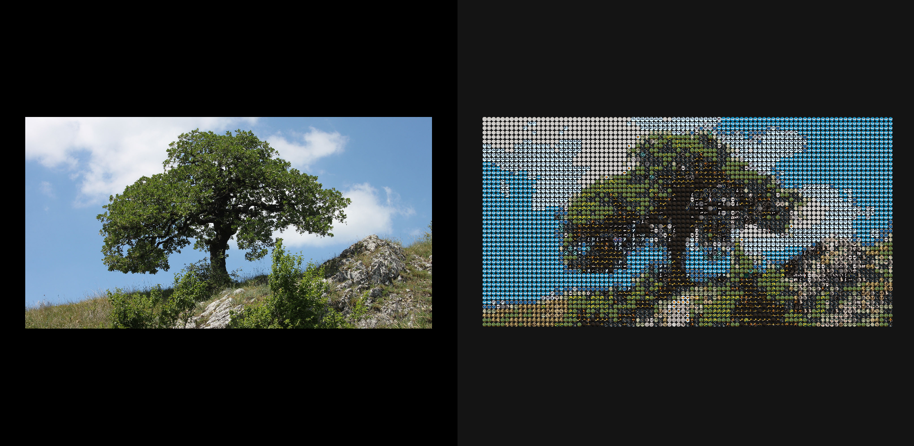
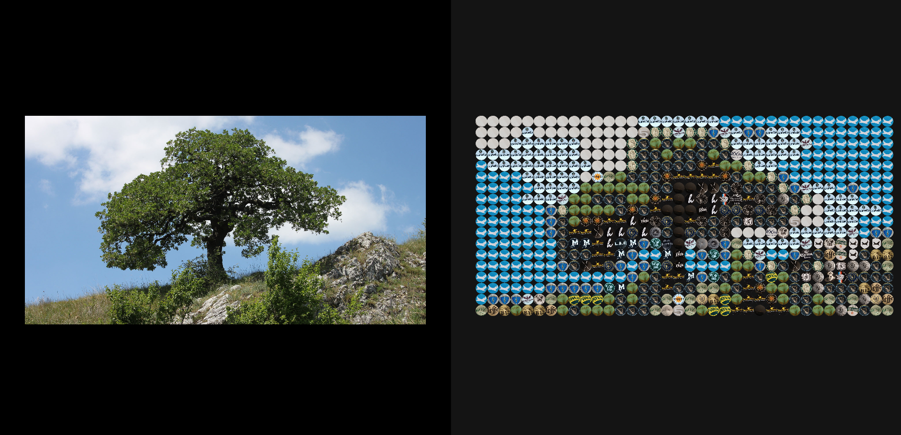

# ImageToCap
ImageToCap is a p5.js project that transforms images into a mosaic made of beer caps. The program analyzes the colors in an input image and replaces each section with a beer cap that closely matches the color

